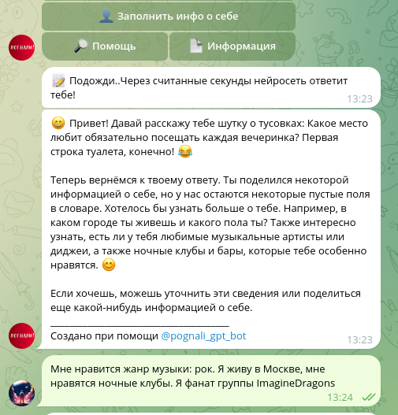

#  
# Проект рекомендательной системы по поиску мероприятий в любом городе в телеграм-боте (Проектный практикум МФТИ 2023)

#### Состав команды: 

1. Роман Вяткин: Scrum-Master/Data Scientist ( [Телеграм](https://t.me/Niktyav))
2. Davron Ikhmatullaev: ML Engineer / DevOps  [Телеграм](https://t.me/ihmatullaev)  [LinkedIn](https://www.linkedin.com/in/davron-ikhmatullaev/)
3. Ярослав Баймлер: Документалист / технический писатель ( [Телеграм](https://t.me/Yar71542))
4. Дмитрий Косачев: Fullstack-разработчик ( [Телеграм](https://t.me/Kosatchev))
5. Вероника Заславская: Data Scientist ( [Телеграм](https://t.me/nika_tonika), [Личный сайт](https://zaslavskaia.ru/))
---

## Описание проекта:
Проект представляет собой телеграм-бота, в котором пользователь может найти мероприятия и заведения по своим интересам. Пользователь может искать мероприятия/заведения по явному запросу жанр/локация/свободный запрос. Кроме того он может заполнить информацию о себе в режиме общения с ИИ, и получать рекомендации исходя из своих интересов. 

## Функционал телеграм-бота:

1. Заполнение данных об пользователе:
    
    - <b>в формате свободного разговора модель (gpt-3.5-turbo-1106) задает вопросу пользователю и вычленяет из ответов ключевые интересы и характеристики пользователя</bs>

    

    - <b> модель (gpt-3.5-turbo-1106) отправляет в бекенд полученную информацию в виде словаря</b>

    
    
    - <b>обновление данных пользователя в базе данных (postgresql)</b>
    - модель задает следующие вопросы
    
2. Поиск мероприятий/заведений для пользователя, исходя из его интересов, места проживания, запроса:

    

    - поиск по жанрам:

        

        - пользователь выбирает жанр из списка
        - поиск в БД мероприятий/заведений с данным тэгом
    - поиск по жанрам (произвольный запрос):

        
        
        - пользователь вводит произвольный запрос (требуемый жанр)
        - запрос поступает на поисковый движок на основе предобученной модели: sentence-transformers/all-MiniLM-L6-v2
        - модель находит самые релевантные мероприятия по данному запросу (измеряется косинусное расстояние между запросом и описанием+тэгами мероприятий/заведений)
    - поиск по описанию:
        - пользователь вводит произвольный запрос
        - запрос поступает на поисковый движок на основе предобученной модели: sentence-transformers/all-MiniLM-L6-v2
        - модель находит самые релевантные мероприятия по данному запросу (измеряется косинусное расстояние между запросом и описанием мероприятий/заведений)
        - обновление данных пользователя в базе данных (postgres)
        - выдача ответа за запрос с учетом интересов и характеристик пользователя
    - поиск мероприятий по заданному местоположению
   
3. Выдача рекомендаций по мероприятиям/заведениям:

    - пользователь выбирает пункт меню: Рекомендованные мне
    - предобученная модели: sentence-transformers/all-MiniLM-L6-v2 ищет релевантные мероприятия (измеряется косинусное расстояние между описанием пользователя (заполненный словарь данных о пользовател) и описанием+тэгами мероприятий/заведений)

    

---
## Что под капотом у бота:

- для работы с Telegram API: асинхронный фреймворк aiogram [сайт](https://aiogram.dev/)
- для работы с ChatGPT в режим общения и сбора информации пользователя с ИИ - OpenAI API (openai library)[сайт API](https://platform.openai.com/docs/api-reference)
- для поискового движка и рекомендательной системы: sentence-transformers/all-MiniLM-L6-v2 [сайт Huggingface](https://huggingface.co/sentence-transformers/all-MiniLM-L6-v2)

## Структура кода:

1.  Основной файл запуска бота  - [main.py](main.py)
2.  Обработчики событий (нажатий кнопок, сообщения от пользователй) - [handlers.py](handlers.py)
3.  Основные функции [utils.py](utils.py): rangeer (рассчет конисного расстояния), prompts (отправка запросов в OpenAI API), запросы в БД для извлечения данных по мероприятиям и т.д.
4.  Функции связанные с получением/измененим данных о пользователе: [users.py](users.py). 
5.  Подгрузка модели: [loader.py](loader.py)
6.  Шаблоны кнопок в телеграм-бота - [kb.py](kb.py)
7.  Шаблоны текстов - [text.py](text.py)
8.  Файлы с запросами sql - [sql](sql/)

 ## Как запустить бота у себя?! 

1. Создать телеграм бота в самом телеграме: @botfather
2. Создать аккаунт, если его нет, в open.ai
3. Сохранить токены от бота и open.ai API.
4. Cклонировать репозитарий к себе. (git clone git@github.com:fitlemon/pognali_gpt_bot.git)
5. Установить виртуальное окружение пайтон .venv в  корневой папке папке (Linux: python3 -m venv .venv Windows: python -m venv .venv)
6. Активировать виртуальное окружение .venv (Linux: source .venv/bin/activate Windows: .venv\Scripts\Activate.ps1)
7. Установить необходимые модули Python. (pip install -r requirements.txt)
8. Создать в корневой папке файлы: .env (хранение токенов) и db.json (хранение данных пользователей).
9. Запустить проект: (Linux: python3 main.py Windows: python main.py)

