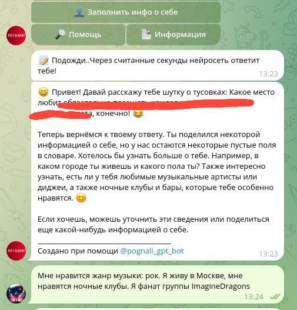
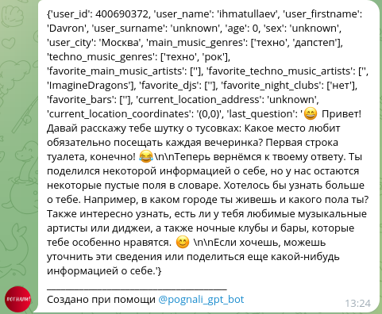
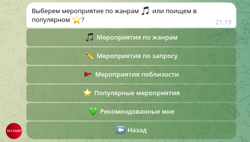
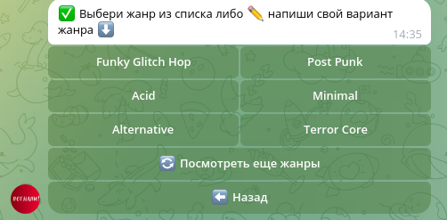
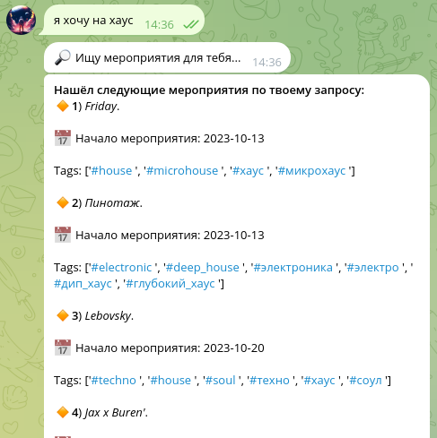
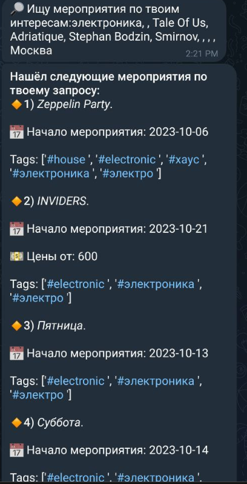

#  
# Проект рекомендательной системы по поиску мероприятий в любом городе в телеграм-боте (Проектный практикум МФТИ 2023)

#### 👥  Состав команды: 

1. Роман Вяткин: Scrum-Master/Data Scientist  [Телеграм](https://t.me/Niktyav)  [LinkedIn](https://www.linkedin.com/in/roman-vyatkin-30782a22a/)
2. Davron Ikhmatullaev: ML Engineer / DevOps  [Телеграм](https://t.me/ihmatullaev)  [LinkedIn](https://www.linkedin.com/in/davron-ikhmatullaev/)
3. Ярослав Баймлер: Документалист / QA Engineer  [Телеграм](https://t.me/Yar71542)
4. Дмитрий Косачев: Fullstack-разработчик  [Телеграм](https://t.me/Kosatchev)
5. Вероника Заславская: Data Scientist  [Телеграм](https://t.me/nika_tonika) [LinkedIn](https://www.linkedin.com/in/veronikazaslavskaya/)
---

#### Презентация:
[Presentation.pdf](Presentation_final.pdf)

## 💡 Описание проекта:
<b>Проект</b> — это инновационный телеграм-бот, предоставляющий пользователям возможность легко находить мероприятия и заведения, соответствующие их уникальным интересам и предпочтениям. Пользователи имеют возможность проводить поиск мероприятий и заведений по различным критериям: от явных запросов, таких как жанр, локация или свободный запрос, до более интерактивного варианта — заполнение персональной информации в ходе диалога с искусственным интеллектом.

Благодаря уникальной функциональности, пользователи имеют шанс не только получать непосредственные результаты по своим запросам, но и взаимодействовать с ботом, предоставляя информацию о себе. В результате этого взаимодействия, бот выстраивает персонализированные рекомендации, основанные на уникальных интересах и предпочтениях каждого пользователя. Этот инновационный подход к поиску развлечений делает проект невероятно удобным и привлекательным для широкого круга пользователей.

🔗 Ссылка на бота: [https://t.me/pognali_gpt_bot](https://t.me/pognali_gpt_bot)

### Стадии работы над проектом:

    ✅ разработка пользовательского пути при взаимодействии с системой;
    ✅ выбор наиболее подходящих моделей, под каждую конкретную функцию;
    ✅ promt engineering для пользовательского интерфейса;
    ✅ подбор метрик, позволяющих объективно оценить качество выдачи;
    ✅ тестирование системы;
    ✅ разработка и вывод системы в production;

## 🔲 Функционал телеграм-бота:

### 1. 💬 Интерактивный диалог с искусственным интеллектом:
    
- 🔹 в формате свободного разговора, одна из передовых моделей от Компании OpenAI (gpt-3.5-turbo-1106) задает пользователю интеллектуальные вопросы, выявляя ключевые интересы и уникальные черты личности.

### 2. 🔧 Анализ вопросов и ответов:

- 🔹 Та же модель (gpt-3.5-turbo-1106), но только настроенная другим промптом тщательно анализирует каждый вопрос-ответ, выделяя важные элементы, и передает полученную информацию в наш бэкенд в виде заполненного словаря.

### 3. 📋 Обновление данных о пользователе: 

- 🔹 Данные пользователя обновляются непосредственно в базе данных PostgreSQL, обеспечивая актуальность и точность информации. Такой процесс позволяет нашему боту лучше понимать предпочтения пользователя.
### 4. 〰️ Континуированный диалог:

- 🔹 Модель продолжает взаимодействие, задавая последующие вопросы, чтобы дополнительно уточнить и дополнить информацию о пользователе. Этот подход создает непрерывный поток обмена данными и обеспечивает наилучшую персонализацию.

### 5. 🎉 Поиск мероприятий: Индивидуальное Путешествие Пользователя

####   5.1 🎵 Поиск по жанрам:

- 🔹 пользователь выбирает жанр из предложенного списка.
- 🔹 производится поиск в базе данных мероприятий/заведений с соответствующим тегом.
####    5.2 ✏️ Поиск по жанрам (произвольный запрос):

- 🔹 пользователь вводит произвольный запрос, указывая желаемый жанр.
- 🔹 запрос отправляется в поисковый движок, использующий предобученную модель sentence-transformers/all-MiniLM-L6-v2.
- 🔹 модель находит наиболее релевантные мероприятия, измеряя косинусное расстояние между запросом и описанием, а также тегами мероприятий/заведений.
- 🔹 история поиска пользователя обновляется в базе данных

####    5.3 ✏️ Поиск по описанию:

- 🔹 пользователь вводит произвольный запрос
- 🔹 запрос направляется в поисковый движок, основанный на модели sentence-transformers/all-MiniLM-L6-v2.
- 🔹 модель находит наиболее релевантные мероприятия, используя косинусное расстояние между запросом и описанием мероприятий/заведений
- 🔹 история поиска пользователя обновляется в базе данных

####  5.4  🚩 Поиск мероприятий по заданному местоположению

- 🔹 пользователь отправляет желаемую локацию

### 6. 💟 Выдача Рекомендаций: Индивидуальный Компас Развлечений

- 🔹 пользователь выбирает пункт меню: "Рекомендованные мне"
- 🔹 предобученная модель: sentence-transformers/all-MiniLM-L6-v2 ищет релевантные мероприятия (измеряется косинусное расстояние между описанием пользователя (заполненный словарь данных о пользователе) и описанием+тэгами мероприятий/заведений)
- 🔹 на основе результатов анализа, предоставленных заполненным словарем данных о пользователе, алгоритмом выбираются мероприятия, которые наиболее точно соответствуют предпочтениям пользователя. Этот этап гарантирует уникальный и вдохновляющий выбор для каждого пользователя

---
## 🔬 Что под капотом у бота:
#### Взлетаем с Aiogram:
- <b>Telegram API в Действии:</b>
Мы используем асинхронный фреймворк [Aiogram](https://aiogram.dev/), чтобы обеспечить быстрый и эффективный обмен данными с Telegram. Это позволяет боту мгновенно реагировать на запросы пользователей и обеспечивает плавное взаимодействие.
#### Волшебство OpenAI:
- <b>Современные Чудеса с OpenAI API:</b>
Пользователь общается с умной моделью ChatGPT благодаря [OpenAI API](https://platform.openai.com/docs/api-reference). Этот магический камень позволяет нам создавать разнообразные и персонализированные диалоги, делая взаимодействие с ботом удивительно естественным.
#### Двигаемся с Sentence-Transformers:
- <b>Мощный Движок Рекомендаций:</b>
Для нашего поискового движка и рекомендательной системы мы используем sentence-transformers/all-MiniLM-L6-v2, полученного с сайта [HuggingFace](https://huggingface.co/sentence-transformers/all-MiniLM-L6-v2). Эта модель позволяет нам находить наиболее релевантные мероприятия, используя продвинутые методы анализа текста.

## ⁉️ Структура кода:

1.  Основной файл запуска бота  - [main.py](main.py)
2.  Обработчики событий (нажатия кнопок, сообщения от пользователей) - [handlers.py](handlers.py)
3.  Основные функции [utils.py](utils.py): rangeer (токенизация, рассчет косинусного расстояния), prompts (отправка запросов в OpenAI API), запросы в БД для извлечения данных по мероприятиям и т.д.
4.  Функции связанные с получением/измененим данных о пользователе: [users.py](users.py). 
5.  Подгрузка модели: [loader.py](loader.py)
6.  Шаблоны кнопок телеграм-бота - [kb.py](kb.py)
7.  Шаблоны текстов - [text.py](text.py)
8.  Файлы с запросами sql - [sql](sql/)
   

 ## 🔛 Как запустить бота у себя?! 

1. Создать телеграм бота в самом телеграме: @botfather
2. Создать аккаунт, если его нет, в open.ai
3. Сохранить токены от бота и open.ai API.
4. Cклонировать репозитарий к себе. (git clone git@github.com:fitlemon/pognali_gpt_bot.git)
5. Установить виртуальное окружение пайтон .venv в  корневой папке папке (Linux: python3 -m venv .venv Windows: python -m venv .venv)
6. Активировать виртуальное окружение .venv (Linux: source .venv/bin/activate Windows: .venv\Scripts\Activate.ps1)
7. Установить необходимые модули Python. (pip install -r requirements.txt)
8. Создать в корневой папке файлы: .env (хранение токенов - см. example.env).
9. Установить СУБД PostgreSQL. Создать БД и Таблицы запуская последовательно скрипты: create_table.sql и остальные скрипты в папке sql.
9. Запустить проект: (Linux: python3 main.py Windows: python main.py)

---

### 💭 Следующие планы:

- разработка коллаборативной рексистемы;
- проведение кластерного анализа объектов;
- доработка контентной рексистемы с учетом кластеризации;
- разработка API для обмена данными;
- проведение A/Б тестов;
- интеграциа с билетными сервисами.

